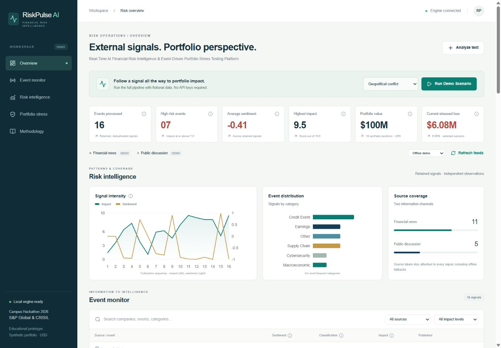
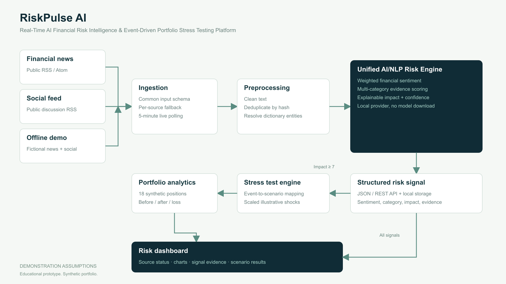
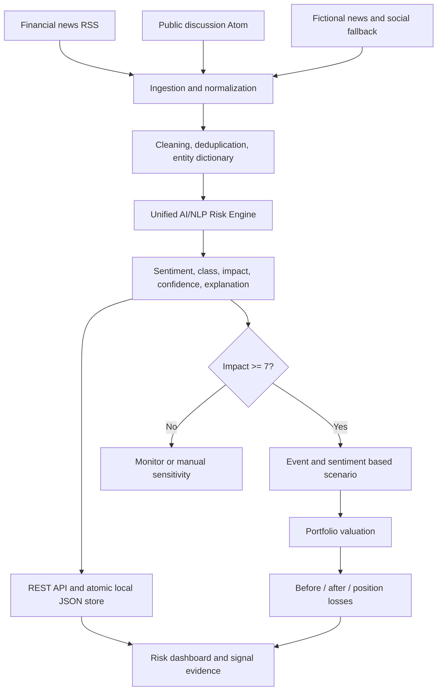

# RiskPulse AI - Real-Time AI Financial Risk Intelligence & Event-Driven Portfolio Stress Testing Platform

**Real-Time AI Financial Risk Intelligence & Event-Driven Portfolio Stress Testing Platform**

**Candidate Name:** Shatadru Adhikary

**College Email ID:** shatadru.23bce8160@vitapstudent.ac.in

**College / Campus:** Vellore Institute of Technology

**Demo Video Link:** https://youtu.be/eO7wFf6rvAw

**Slide Deck Link:** [Seven-slide PDF](docs/presentation.pdf) · [Editable PowerPoint](docs/presentation.pptx)

**Public Repository:** [vit-shatadru-adhikary-hackathon](https://github.com/Shatadru281/vit-shatadru-adhikary-hackathon)

> Educational hackathon prototype. **SYNTHETIC DATA — DEMONSTRATION ONLY.** Scenario assumptions are illustrative, not investment advice or calibrated production risk parameters. This project does not imply endorsement by S&P Global or CRISIL.

## 1. Project Overview / Problem Statement & Approach

Financial news and public discussions can reveal events before they appear in periodic portfolio reports. RiskPulse AI translates this unstructured information into structured financial risk intelligence and connects it directly to illustrative portfolio-level impact.

**Information → Intelligence → Risk Signal → Scenario → Portfolio Impact → Decision Support**

Two replaceable source adapters feed a unified, deterministic AI/NLP risk engine. Every signal includes sentiment, event category, impact, evidence confidence, recognized entities and a scoring explanation. **Module B: Strategic Portfolio Stress Testing** automatically runs an independent scenario whenever impact is at least 7. The dashboard shows before/after portfolio values and position-level attribution. Module A is intentionally out of scope.

No paid API, model download, database service, Python runtime or credentials are needed. An empty local store seeds both fictional data sources automatically. The demo works offline after dependencies are installed.



See the [implementation report](docs/IMPLEMENTATION_REPORT.md) and [executed verification record](docs/VERIFICATION.md) for delivery details.

## 2. Architecture & Tech Stack





| Layer             | Technology                                                                      |
| ----------------- | ------------------------------------------------------------------------------- |
| Runtime           | Node.js 20.19+; a current Node 22/24 release is recommended                     |
| Application       | Next.js 16 App Router, React 19, strict TypeScript                              |
| Dashboard         | Tailwind CSS 4, scoped CSS, Recharts, Lucide icons                              |
| Contracts         | Zod input, output, portfolio and persistence schemas                            |
| NLP               | Local financial lexicon, scoped negation, intensifiers, weighted classification |
| Ingestion         | RSS/Atom with fast-xml-parser and per-source fallback                           |
| Storage           | Atomic JSON file, serialized operations in one Node process                     |
| Verification      | Vitest unit/integration tests, actual HTTP smoke checks, ESLint, TypeScript     |
| Submission assets | TypeScript + Sharp diagram generator, PptxGenJS presentation generator          |

```text
src/app/                    Dashboard route and REST handlers
src/components/             Charts, event feed, evidence, stress table
src/services/ingestion/     News, social, offline and RSS adapters
src/services/nlp/           Sentiment, classification, entities, impact, provider
src/services/stress/        Scenario mapping and valuation
src/services/pipeline.ts    Deduplication, persistence, automatic triggers
src/lib/                    Storage, API errors, text, math and formatting
src/types/                  Shared TypeScript types and Zod schemas
data/                       Fictional news, social, companies and 18 positions
docs/                       Methodology, demo script, architecture, deck, results
scripts/                    Asset generators and actual HTTP verification
tests/                      NLP, ingestion, stress, API and persistence tests
```

## 3. Dataset Used

| Source            | Live input                                                         | Offline fallback                                 |
| ----------------- | ------------------------------------------------------------------ | ------------------------------------------------ |
| Financial news    | [BBC business RSS](https://feeds.bbci.co.uk/news/business/rss.xml) | `data/demo-news.json`, 10 fictional reports      |
| Public discussion | [Reddit finance Atom](https://www.reddit.com/r/finance/.rss)       | `data/demo-social.json`, 5 synthetic discussions |

Live reports are public, unverified inputs; the application does not authenticate their claims. Feed access may be denied, empty, slow or rate-limited. Each adapter times out after five seconds and falls back independently. The UI labels **live**, **demo** or **fallback**, with the fallback reason in the source tooltip. Real and fictional signals retain their individual provenance even if both exist in the store.

The fictional company names are Ardent Bank, Northstar Technology, Meridian Energy, Harbor Logistics, Evergreen Manufacturing and Helix Healthcare. Real company names in `company-map.json` are lookup examples only; no synthetic allegation is attached to those names. The 18-position portfolio is entirely invented, with a $100M USD-equivalent baseline and six asset classes. All values, exposures, ratings, PDs, LGDs and counterparties are assumptions. No confidential sponsor or client data is included.

Demo timestamps are rebased to the current clock when seeded or replayed, then persisted. Original JSON dates identify fixture content only. This is a simulated feed, not evidence of current real-world events.

## 4. Quickstart & Installation

**Runtime and tested platform:** Node.js 22.12.0 and npm 11.6.0 on Windows. A current Node.js 22/24 release is recommended; minimum Node.js 20.19.

For a fresh checkout:

```bash
git clone https://github.com/Shatadru281/vit-shatadru-adhikary-hackathon.git
cd vit-shatadru-adhikary-hackathon
npm install
npm run dev
```

Open **http://127.0.0.1:3000** (or http://localhost:3000). No environment file is required. To customize defaults, copy `.env.example` to `.env.local` and restart the server. `DATA_MODE=demo` is the default.

Production:

```bash
npm run build
npm start
```

Stop the development server before starting production on the same port. To choose a different port: `npm run dev -- --port 3001` or `npm start -- --port 3001`.

Verification and regenerated submission assets:

```bash
npm test
npm run typecheck
npm run lint
npm run format:check
npm run verify:api       # Requires a running server on port 3000
npm run docs:generate   # Architecture PNG/SVG, 7-slide PPTX, computed demo results
```

For a different API URL, set `BASE_URL` in your shell before `npm run verify:api`. Tests isolate their storage in a temporary directory. The HTTP script intentionally submits one synthetic example to the running application and replays all five demos.

**Local persistence:** `.riskpulse/state.json` is created on the first dashboard or ingestion request and ignored by Git. The directory must be writable. Keep one server process per store. To reset, stop the server and move that file to a backup location; reopening the dashboard seeds fresh examples. Invalid JSON is preserved with a `.corrupt-<timestamp>` suffix and the dashboard reports reseeding. Permission and disk errors return actionable errors instead of silently discarding data.

**Live mode:** choose **Try live feeds**, then **Refresh feeds**. While the dashboard is open it polls state every 30 seconds; the server refreshes live sources at most every five minutes. Selecting **Offline demo** and refreshing stops live polling. These are polling intervals, not a streaming latency guarantee. `DATA_MODE=live` controls first initialization of an empty store; stored source selection persists thereafter.

## 5. Key Results & Domain Impact

The provided fixtures exercise five complete demonstrations. The application computes outputs; they are not hardcoded into the dashboard. A reference run of the current implementation gives:

| Scenario               | Sentiment | Impact | Automatic stress |   Illustrative loss |
| ---------------------- | --------: | -----: | ---------------- | ------------------: |
| Geopolitical conflict  |    -0.982 |    9.5 | Yes              |              $6.08M |
| Credit downgrade       |    -0.996 |    9.0 | Yes              |              $4.50M |
| Central-bank rate hike |    -0.905 |    8.6 | Yes              |              $6.31M |
| Cyberattack            |    -0.999 |    8.6 | Yes              |              $1.13M |
| Positive earnings      |    +0.990 |    5.1 | No               | No automatic result |

Exact reference values are regenerated in [docs/demo-results.json](docs/demo-results.json). Sentiment values round to two decimals in the dashboard. Older stored evidence can have slightly different recency contributions. Replaying a demo refreshes its simulated timestamp, recomputes its scores through the real engine and replaces the prior fixture result without duplicating it.

The prototype makes a signal's evidence and its financial transmission channel visible together. A judge can inspect matched terms, scenario shocks, aggregate loss and position formulas from one screen. The results demonstrate software behavior, not predictive accuracy or actual expected portfolio losses.

## 6. Methodology

Sentiment uses weighted financial phrases with a three-token negation scope and intensifiers, then applies `tanh(weightedSum / (3.5 + 0.45 × matchCount))`. Classification chooses the highest sum of weighted keyword/phrase evidence across eleven categories. Confidence measures strength and separation of rule evidence, not a calibrated probability.

Impact is the clamped sum of category severity, absolute sentiment, urgency, systemic language, entity breadth, source heuristic, confidence and age decay. The **impact ≥7** rule triggers a scenario. Scenario size depends on impact and absolute sentiment; favorable sentiment reverses the illustrative shock direction.

Valuation uses equity beta, bond duration, **incremental** expected loan loss, signed DV01 and signed FX exposure. Every scenario starts from the same original portfolio. Gains are retained and scenarios are never summed together. Full formulas, units, base shocks and limitations: [METHODOLOGY.md](docs/METHODOLOGY.md).

## 7. API

All responses use JSON and `Cache-Control: no-store`. POST bodies require `Content-Type: application/json`. Schemas reject unknown fields. Request bodies are limited to 64 KB; analyze text is limited to 10–12,000 characters. Unrecognized HTTP methods receive Next.js's 405 response.

| Method | Endpoint            | Request / response                                                                                                                                               |
| ------ | ------------------- | ---------------------------------------------------------------------------------------------------------------------------------------------------------------- |
| GET    | `/api/health`       | Engine, mode, version and timestamp; a liveness check                                                                                                            |
| GET    | `/api/dashboard`    | Full retained state and original portfolio                                                                                                                       |
| GET    | `/api/events`       | `{ events: [{ item, signal, fingerprint }] }`                                                                                                                    |
| GET    | `/api/risk-signals` | `{ signals: RiskSignal[] }`                                                                                                                                      |
| POST   | `/api/analyze`      | `{ text, title?, sourceType?: "news" \| "social" }`; signal fields plus `stressTest` or null                                                                     |
| POST   | `/api/ingest`       | `{ mode: "demo" \| "live", scenario?: "geopolitical" \| "credit" \| "rates" \| "cyber" \| "earnings" }`; processed events, added count and linked stress results |
| GET    | `/api/portfolio`    | Synthetic-data label, USD total and all positions                                                                                                                |
| GET    | `/api/stress-test`  | `{ stressTests: StressResult[] }`                                                                                                                                |
| POST   | `/api/stress-test`  | `{ eventId: "sig_..." }`; existing scenario or new manual sensitivity, including below-threshold signals                                                         |

```bash
curl -X POST http://127.0.0.1:3000/api/analyze \
  -H 'Content-Type: application/json' \
  -d '{"text":"Ardent Bank credit rating was downgraded after severe liquidity concerns and a systemic liquidity crisis."}'
```

PowerShell equivalent:

```powershell
$body = @{ text = 'Ardent Bank credit rating was downgraded after severe liquidity concerns and a systemic liquidity crisis.' } | ConvertTo-Json
Invoke-RestMethod http://127.0.0.1:3000/api/analyze -Method Post -ContentType 'application/json' -Body $body
```

Analyze returns **201** for a newly stored event and **200** for a duplicate. Ingest uses the same rule. Validation/malformed JSON returns **400**, unknown signal **404**, body limit **413**, wrong content type **415**, and unexpected storage/server errors **500**. Feed failures return successful, explicitly labeled fallback results. Demo scenarios cannot be combined with `mode: live`.

## 8. Demo

1. Open the dashboard. Both offline sources and a populated synthetic portfolio load automatically.
2. Select **Geopolitical conflict**, then **Run Demo Scenario**.
3. Read the sentiment, category and impact. Open **Why this signal?** and **Structured API output**.
4. Inspect the automatically triggered **Portfolio impact**, shock assumptions, before/after chart and position table. Export JSON if helpful.
5. Run **Positive earnings**. Its lower impact keeps it in monitoring, with no automatic stress scenario. Optional manual sensitivity is explicit.

The submission guidelines specify a **10-minute screen recording**. Use the [timed narration and on-screen actions](docs/DEMO_SCRIPT.md), [printable Word script](docs/VIDEO_SCRIPT.docx), and [recording and upload guide](docs/RECORDING_GUIDE.md). The earlier [five-minute jury rehearsal](docs/JURY_PITCH.md) is an optional shorter practice version, not the submission video.

The [seven-slide PDF](docs/presentation.pdf), [editable deck](docs/presentation.pptx), and [architecture image](docs/architecture.png) are included. Review the [submission checklist](docs/SUBMISSION_CHECKLIST.md) and [technical Q&A](docs/JURY_QA.md) before recording.

## 9. Limitations

- Heuristic English NLP can miss sarcasm, complex negation, conditional claims and emerging vocabulary. Keyword evidence does not verify a report.
- Entity recognition is dictionary-based. Unknown companies will not receive issuer-specific shocks, although market-wide assumptions still apply.
- Impact and confidence are uncalibrated. Absolute sentiment can make positive events important; favorable scenarios are sensitivities, not predictions.
- Financial shocks use fixed illustrative parallel moves. No yield-curve detail, convexity, option valuation, liquidity costs, dependence estimation or historical calibration is modeled.
- FX positions use signed USD-equivalent exposure to a common foreign-currency move. Derivative notionals and positive mark-to-market values are intentionally synthetic.
- Exact content deduplication does not perform semantic corroboration or independent source verification. Up to 500 events are retained; linked old scenarios are pruned.
- Local JSON supports one Node process on a writable filesystem. Do not use PM2 clustering, shared multi-worker writes or ephemeral serverless storage without replacing the persistence adapter.
- The local app binds to loopback. Authentication, rate limiting, deployment hardening, observability and data licensing review would be required before any hosted multi-user service.
- No external LLM is wired up. The `AIProvider` interface is the extension seam; the only shipped provider is deterministic and local.

## 10. Future Improvements

Evaluate finance-specific transformer models against labeled datasets, improve entity resolution, corroborate independent sources, calibrate historical shocks, add streaming ingestion, Monte Carlo simulation, VaR / expected shortfall and graph-based contagion. Replace the store with transactional SQLite/Postgres before scaling.

Model choice was informed by the [Transformers.js pipeline documentation](https://huggingface.co/docs/transformers.js/en/pipelines): compatible ONNX models are available, but downloaded weights, first-load behavior and financial-domain validation add demonstration risk. The required local hybrid method keeps this submission reproducible and offline. Framework setup follows the [Next.js App Router documentation](https://nextjs.org/docs/app/getting-started/installation).

**AI assistance and individual submission:** This project was developed with AI assistance for implementation, debugging, tests, and documentation. It is submitted by Shatadru Adhikary as an individual project. The candidate is responsible for reviewing the implementation, understanding its assumptions, and explaining it during the jury session. No claim of writing every line without assistance is made.

**Before submission:** record the 10-minute walkthrough, upload it to YouTube as **Unlisted**, replace the pending video line above, and test the repository, PDF and video links while signed out. Submit the final repository URL, video URL and deck through the official form by the deadline communicated by the organizers. The supplied guideline document does not contain an actual deadline or form URL. An MIT license is included. Dependencies, build artifacts, runtime stores, videos and environment secrets are excluded from Git and the submission archive.
